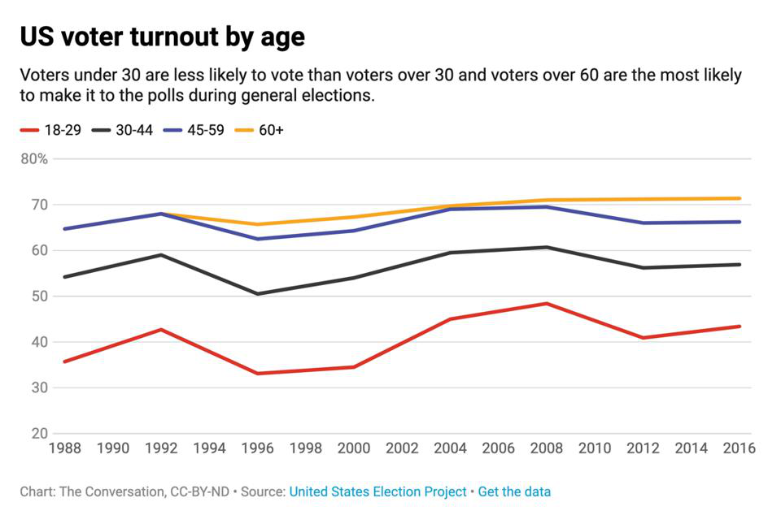
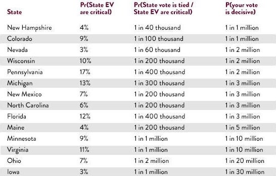

This is an [R Markdown](http://rmarkdown.rstudio.com) Notebook. When you execute code within the notebook, the results appear beneath the code. 

Try executing this chunk by clicking the *Run* button within the chunk or by placing your cursor inside it and pressing *Cmd+Shift+Enter*. 

```{r include=FALSE}
library(tidyverse)
library(ggplot2)
library(dplyr)
library(reshape2)
library(stringr)
library(tabulizer)
library(rvest)

```

## Introduction and Overview

Voting has become an increasingly important topic, especially in the United States. Studies have shown that those ages 18 to 29 have consistently voted at lower levels, over 15% lower, than general election turnout. This can be attributed to many reasons. Habit formation in initial voting, opportunity cost of voting, and alternative participation like protesting. Another reason is that the value of voting is not apparent. Someone voting in California, where it will almost assuredly vote democratic, may not see a point to participating in a process where their vote is drowned in a sea of trillions of others. 

```{r echo=FALSE, results='hold', fig.cap="Voter Turnout by Age"}

```


Without this knowledge of value, people will not understand the impact they can have and continue to be unseen in elections. To increase voter turnout, it is imperative that the value of one’s vote becomes clear at every level of election around them. For instance, the 2020 election has been one of the most heavily funded elections with the most voter turnout in U.S. history. The record number of civil engagements highlighted the importance of this election. We have seen many different organizations like the NFL, NBA, Facebook, and others continuously push voting ad-campaigns like never before. It immediately made us think about the value of our singular votes and how much change we can affect with just this one action. We also wanted to provide an alternative view to the case of voting, besides the worn out “civic duty” argument, to peers around us who did not see reason in voting.
 
However, just how much is your vote worth? How much does a vote actually matter in terms of its economic impact? These questions could be critical in future campaign in promoting voting by directly demonstrating in a quantitative fashion how much impact each vote makes. 
 
In order to begin answering these questions, we obtained a detailed breakdown of data on voter turnout, how much money each administration has spent on relevant sectors such as education, agriculture, military dense etc. and the possibility of a single vote overturning election results by state from past US presidential elections. We then can calculate the monetary value of each vote for particular sectors of interests. Further we hope to use these datasets to draw inferences for the values in a single vote in 2024 election.


## Related Work

While civil engagement has been a topic of interest for an extended period of time, when searching literature bases, we found that most of the studies on values in voting are related to communal moral values and political social values, instead of our focus on physical monetary values. 
 
The value of a singular vote is often discussed in many commentaries and literature. For example, the article titled “The Importance of Voting” (https://www.castleton.edu/news-media/article/the-importance-of-voting/) discussed how many political scientists and civic educators express the idea that voting is important without explaining why that is the case. It also discussed this misconception that many Americans have about their votes appearing unimportant and unlikely to make a difference. It presents the striking statistics that for 2016 presidential election, the entire outcome hinged on approximately 78,000 votes, or less than 0.06% of the total votes cast. More so, in 2017, the 94th District of the Virginia House of Delegates, wherein 11,608 ballots were cast, resulted in a tie, and the winner was chosen by randomly drawing a name from a hat. These tight races all highlight the importance of even singular votes and similar examples vastly exceed just the two mentioned above. 
 
On the other hand, research in voter turnout has shown that the U.S. trails consistently most developed countries. According to Pew Research (https://www.pewresearch.org/fact-tank/2020/11/03/in-past-elections-u-s-trailed-most-developed-countries-in-voter-turnout/), in 2016, the U.S. had a 55.7% VAP turnout which puts the U.S. behind most of its peers in the Organization for Economic Cooperation and Development, most of whose members are highly developed democratic states. Additionally, turnout rate for people of color was also a concerned with a significant decline in the 2016 election, according to Pew Research (https://www.pewresearch.org/fact-tank/2017/05/12/black-voter-turnout-fell-in-2016-even-as-a-record-number-of-americans-cast-ballots/). These studies suggest that conveying the monetary values of civic engagement, and targeted support for people of color and underrepresented minority are important to facilitate higher voter turnout and could be highly beneficial to the democratic process.

## Initial Questions

Voting has become an increasingly important topic, especially in the United States. Those ages 18 to 29 have consistently voted at lower levels, over 15% lower, than general election turnout. This can be attributed to many reasons. Habit formation in initial voting, opportunity cost of voting, and alternative participation like protesting. Another reason is that the value of voting is not apparent. Someone voting in California, where it will almost assuredly vote democratic, may not see a point to participating in a process where their vote is drowned in a sea of trillions of others. Without this knowledge of value, people will not understand the impact they can have and continue to be unseen in elections. To increase voter turnout, it is imperative that the value of one’s vote becomes clear at every level of election around them.

On a more personal note, we have seen many different organizations like the NFL, NBA, Facebook, and others continuously push voting ad-campaigns like never before. It immediately made us think about the value of our singular votes and how much change we can effect with just that one action. We also wanted to provide an alternative view to the case of voting, besides the worn out “civic duty” argument, to peers around us who did not see reason in voting.


## Data Sources:

In this project, we use three main data sources, supplemented by other various datasets that have been web scraped. These sources allowed us to quantify the value of a single vote over the past 40 years of presidential elections. 

#### MIT Election Lab

The MIT Election Lab is an online repository that stores past years (up to 1976) of election data at various levels (senate, presidential, etc.) These datasets are continuously updated each year, with new elections. Data in this repository is thoroughly cleaned, such that users can perform their own analysis directly after downloading. This dataset was used to obtain the voter turnout for each state at both the presidential and senate level (1976 - 2016). It lists not only the winner’s vote total for each state, but also other candidates' vote totals as well. From this dataset, we were able to derive voter turnout by state, margins of victory by state, and flipping of states between elections from 1976 to 2016. 

```{r}
presidential <- read.csv("Data/1976-2016-president.csv")
senate <- read.csv("Data/1976-2018-senate.csv")

head(presidential)
```

We also used an analysis dataset published from this repository. This dataset consisted of the voter demographics in each county of the United States for the 2012 and 2016 presidential elections. It included voting breakdowns by race, gender, age, level of education, level of employment, and environment. We used this to understand more about the voting population, as well as, predict the value of a vote. 

```{r}
context <- read.csv("Data/election-context-2018.csv")
head(context)
```


```{r}
#Analysis 1
presidential <- read.csv("Data/1976-2016-president.csv")
senate <- read.csv("Data/1976-2018-senate.csv")
context <- read.csv("Data/election-context-2018.csv")

context_state<- context %>%
  group_by(state) %>%
  dplyr::select(-county) %>%
  summarise_each(funs(mean))

#Voter Turnout Over Time
senate_turnout <- senate %>%
  group_by(year, state) %>%
  filter(row_number()==1) %>%
  dplyr::select(year, state, totalvotes)
presidential_turnout <- presidential %>%
  group_by(year, state) %>%
  filter(row_number()==1) %>%
  dplyr::select(year, state, totalvotes)

#Margins of Victory
margin_pres <- presidential %>%
  group_by(year,state) %>%
  arrange(desc(candidatevotes), .by_group = TRUE) %>%
  filter(row_number() %in% c(1,2)) %>%
  dplyr::select(year, state, candidate, candidatevotes, totalvotes, party) %>%
  summarize(margin = mean((candidatevotes[1]-candidatevotes[2])/totalvotes), party = party[1])

margin_sen <- senate %>%
  group_by(year,state) %>%
  arrange(desc(candidatevotes), .by_group = TRUE) %>% 
  filter(row_number() %in% c(1,2)) %>%
  dplyr::select(year, state, candidate, candidatevotes, totalvotes, party) %>%
  summarize(margin = mean((candidatevotes[1]-candidatevotes[2])/totalvotes), party = party[1])

# Switching Parties
parties_pres <- presidential %>%
  group_by(year,state) %>%
  arrange(desc(candidatevotes), .by_group = TRUE) %>%
  filter(row_number() == 1) %>%
  dplyr::select(year, state, candidate, party)
# Possibly list how many times a state switched over time
parties_sen <- senate %>%
  group_by(year,state) %>%
  arrange(desc(candidatevotes), .by_group = TRUE) %>%
  filter(row_number() == 1) %>%
  dplyr::select(year, state, candidate, party)

```


#### White House Office of Management and Budget

The White House’s Office of Management and Budget website contains historical tables that detail spending over several different categories (discretionary, deficits, agency, etc.) From this site, we were able to download the discretionary spending estimates over each year, starting from 1976, to an estimated amount in 2025. These estimates were split by agencies (Department of Defense, Department of Education, Department of Transportation, etc.) This was downloaded as a csv file, which was then cleaned in R. 

We aggregated this data over each president’s term to get the total discretionary spending per term. This was then used to find the monetary value of one person’s vote in a given state for the given election year. 

```{r}
# Contains the mandatory federal spending per year per agency
budg_all <- read.csv("Data/budget_amount.csv")
budg_all <- data.frame(lapply(budg_all, as.character), stringsAsFactors=FALSE)
colnames(budg_all) = budg_all[2,]
rownames(budg_all) = budg_all[,1]
budg_all = budg_all[-c(1,2,33,34),-1]
cols <- colnames(budg_all)
rows <- rownames(budg_all)
budg = as.data.frame(lapply(budg_all, function(x) as.numeric(gsub(",","",x))))
colnames(budg) <- cols
rownames(budg) <- rows
budg <- budg[,-c(1,2)]
budg_admin <- as.data.frame(sapply(seq(1,dim(budg)[2]-1,by=4),function(i) rowSums(budg[,i:(i+3)], na.rm=TRUE)))

colnames(budg_admin) <- c(as.numeric(colnames(budg[,seq(1,dim(budg)[2]-5,by=4)])) - 1, 2020)

```

#### United States Election Project

The United States Election Project is an information source that houses election data for each state over the past 50 years of elections. This source was mainly used to obtain the voter turnout as a percentage of the total eligible voters. This was combined with two other sources to obtain the full voter turnout per state from the 1976 to 2016 presidential election. 

Show missing 1976 and 2016 columns and then explain later how it was filled in with web scraping

```{r Turnout}

location <- 'https://sos.nh.gov/media/ni0j3zb5/1976-2016-presidental-election-highest-office-divided-by-vap.pdf'
out <- extract_tables(location)
df <- out[[2]]
final <- as.data.frame(df)
final <- final[,-c(1,4,7,10,13,16)]
final <- data.frame(lapply(final, as.character), stringsAsFactors=FALSE)
colnames(final) <- final[1,]
final <- final[-1,]

final <- final[,c(11,12)]
final <- final %>%
  filter(`2016` != "United States")
final$X <- 2016
final <- final[,c(3,1,2)]
colnames(final) <- c("Year", "State", "Turnout")
final$Year <- as.numeric(final$Year)

write.csv(final,"Data/2016_Turnout.csv",row.names=F)

#other <- as.data.frame(out[[1]])


check <- read.csv("Data/Turnout.csv")
check <- check %>%
  filter(X %in% seq(1976, 2016, by = 4)) %>%
  filter(State != "United States") %>%
  select(X, State, X.4)
colnames(check) <- c("Year", "State", "Turnout")
check$Year <- as.numeric(as.character(check$Year))
total_turnout <- rbind(final,check)
total_turnout$Turnout <- as.numeric(gsub("%","",total_turnout$Turnout))

old_turnout <- data.frame(State = c("Minnesota", "Utah", "North Dakota", "Wisconsin", "South Dakota", "Maine", "Montana", "Iowa", "Conneticut", "Massachusetts", "Oregon", "Idaho", "Indiana", "Washington", "Rhode Island", "Illinois", "Colorado","Kansas", "Michigan","Wyoming","New Jersey","Missouri", "New Hampshire","Delaware","West Virginia", "Nebraska","Vermont","Ohio","Oklahoma", "Pennsylvania", "New Mexico","Arkansas","New York", "California","Maryland","Florida","Louisiansa", "Tennessee","Alaska","Mississippi","Kentucky", "Virginia","Hawaii","Texas","Alabama","Arizona","Nevada","North Carolina","Georgia","South Carolina", "District of Columbia"), Turnout = c(71.5, 68.4, 67.2, 66.5, 64.1, 63.6, 63.3, 
                       63.1, 62.7, 61.6, 61.3, 60.6, 60.1, 59.8,
                       59.6, 59.4, 58.8, 58.8, 58.8, 58.5, 57.7, 
                       57.3, 57.2, 57.2, 57.1, 56.2, 55.7, 55.1, 
                       54.8, 54.1, 53.4, 51.1, 50.6, 50.4, 49.3,
                       49.1, 48.7, 48.6, 48.0, 48.0, 47.9, 46.9, 46.6, 
                       46.3, 46.3, 46.1, 44.1, 42.9, 42.0, 40.2,
                       32.2))
old_turnout$Year <- 1976
old_turnout <- old_turnout[,c(3,1,2)]

write.csv(old_turnout,"Data/1976_Turnout.csv",row.names=F)

total_turnout <- rbind(total_turnout, old_turnout)


# how im reading turnout in shiny app, 
turnout <- read.csv("Data/Turnout.csv") %>%
  filter(X %in% seq(1976, 2016, by = 4)) %>%
  select(X, State, X.4) %>% 
  rename(year=X,state=State, turnout=X.4)
turnout_1976 <- read.csv("Data/1976_Turnout.csv")
turnout_2016 <- read.csv("Data/2016_Turnout.csv") %>% mutate(State=recode(State,!!!c("Dist. of Columbia"="District of Columbia")))
```


#### Andrew Gelman

Andrew Gelman is a professor of statistics and political science at Columbia University. He was one of the first people to publish studies that utilized statistical models to quantify the value of a vote. His work in the field motivated much of this work, and also served as a key data source. He published an article on Slate (https://slate.com/news-and-politics/2016/11/here-are-the-chances-your-vote-matters.html) that listed the probability of a single vote being decisive in the 2012 election.

```{r echo=FALSE, results='hold', fig.cap="Adapted from Gelman's Slate Article"}

```

These were separated by states, with battleground states having higher values, Wisconsin with a 1 in 2 million chance, and dominant states having lower values, Oklahoma with a 1 in 30 billion chance. We used the probability of influencing an election, along with the discretionary budget data, to find the monetary value of a vote based on state and year. It should be noted that we do not replicate Gelman’s statistical models over each election year and utilize just one election year for our analysis. 

```{r}
#Adapted from: https://slate.com/news-and-politics/2016/11/here-are-the-chances-your-vote-matters.html
influence = data.frame(state = c(state.abb), 
                       chance = c(1/7e9,1/100e6,1/40e6, 1/3e9,
                                 1/7e9,1/1e6, 1/40e6, 1/300e6,
                                 1/3e6, 1/60e6, 1/1e9, 1/10e9,
                                 1/1e9, 1/3e9, 1/30e6, 1/1e9,
                                 1/8e9, 1/5e9, 1/5e6, 1/10e9,
                                 1/4e9, 1/3e6, 1/10e6, 1/1e9,
                                 1/1e9, 1/2e9, 1/4e9, 1/2e6,
                                 1/1e6, 1/400e6, 1/3e6, 1/3e9,
                                 1/3e6, 1/4e9, 1/20e6, 1/30e9,
                                 1/40e6, 1/2e6, 1/30e6, 1/100e6,
                                 1/3e9, 1/3e9, 1/1e9, 1/2e9,
                                 1/10e9, 1/10e6, 1/200e6, 1/9e9,
                                 1/2e6, 1/30e9))


va <- influence %>%
  filter(state == "VA")
va_example <- budg_admin * va$chance * 1e6
```


#### Web Scraping

We web scraped several other datasets to fill in gaps found throughout the process. One of these was the voter turnout from 2016. This was obtained by scraping a table from sos.nh.gov that contained voter turnout in the year 2016. Various other datasets that showed differences in administration’s proposed budgets were also web scraped from https://www.thebalance.com/ . This site contains the breakdown of discretionary spending per year, and contains tables comparing President Trump to President Obama’s (2012) proposed budgets. We also scraped data from govinfo.gov that contained data comparing President Bush’s and President Obama’s (2008) proposed budget. 


```{r Web Scraping}
# Web Scraping, Potentially not needed
clean_table <- function(df){
  rownames(df) <- df[,1]
  df[,1] <- NULL
  colnames(df) <- df[1,]
  df <- df[-1,]
} 
get_table <- function(url, i){
  h1 <- read_html(url)
  try <- h1 %>% html_nodes("table") %>% .[i]
  budget <- try %>% html_table %>% .[[1]] 
  budget <- clean_table(budget)
  return(budget)
}

budget_2020 <- get_table("https://www.thebalance.com/fy-2020-federal-budget-summary-of-revenue-and-spending-4797868", 1)


turl <- "https://www.thebalance.com/how-trump-amended-obama-budget-4128986"
h   <- read_html(turl)
tab <- h %>% html_nodes("table")
try <- h %>% html_nodes("table") %>% .[1]
budget_comp <- try %>% html_table %>% .[[1]] 

url_2013 <- "https://www.thebalance.com/fy-2013-u-s-federal-budget-and-spending-3306319"
h1 <- read_html(url_2013)
try_2013 <- h1 %>% html_nodes("table") %>% .[2]
budget_2013 <- try_2013 %>% html_table %>% .[[1]] 


budget_2013 <- clean_table(budget_2013)
budget_comp <- clean_table(budget_comp)

# Location of WARN notice pdf file
location <- 'https://www.govinfo.gov/content/pkg/BUDGET-2009-BUD/pdf/BUDGET-2009-BUD-31.pdf'

# Extract the table
out <- extract_tables(location)
df <- out[[4]]
final <- as.data.frame(df)
final <- final[-c(1:5),]
final[,c(5:7)] <- NULL
rows <- as.character(final[,1])
final[,1] <- NULL
colnames(final) <- c("2001", "2008", "2009")
final_f <- mutate_all(final, function(x) as.numeric(as.character(x)))
rownames(final_f) = str_match(rows, "^(.*?)\\.")[,2]
```

## Exploratory Analysis

We broke down our exploratory analysis into four main portions: 

* Demographics

* Voting Trends Over Time

    + Voter Turnout
    + Voting Margin of Victory
    + Election Result by State

* Discretionary Budget Breakdown

* Value of a Single Vote

#### Demographics


```{r Demographics}

# Demographics, 2016 Election, show as table 
demo <- context_state[,-c(2:22)]
demo <- demo %>%
  filter(!state %in% c("Missouri", "Virginia", "South Dakota"))
head(demo)

```

#### Voting Trends Over Time

We first wanted to explore trends in voter turnout over time. The plots below show the overall voter turnout from 1976 to 2016, as well as state level voter turnout. In our shiny app, we allow the user to select up to six states to display the voter turnout. 

```{r InitalPlots}
overall_turnout <- presidential_turnout %>%
  group_by(year) %>%
  summarize(total = sum(totalvotes))

# Overall Voter Turnout
overall_turnout %>%
  ggplot(aes(year,total)) + 
  geom_line() +
  geom_point()
```

```{r }
#Voter turnout by State, could have user select state
presidential_turnout %>%
  filter(state == "Virginia") %>%
  ggplot(aes(year,totalvotes)) + 
  geom_line() +
  geom_point()

```

What we realized is that this only communicated the number of total people that voted from a given state. This would not be an effective way to show voter turnout especially when comparing a state like California with a high population to Oklahoma with a much lower population. This is why we pulled the voter turnout percentage from each state using the dataset provided by the United States Election Project, as talked about above.

```{r }
# Use the turnout percentage
#Voter turnout by State, could have user select state
turnout <- read.csv("Data/Turnout.csv") %>%
  filter(X %in% seq(1976, 2016, by = 4)) %>%
  select(X, State, X.4) %>% 
  rename(year=X,state=State, turnout=X.4)
turnout_1976 <- read.csv("Data/1976_Turnout.csv")
turnout_2016 <- read.csv("Data/2016_Turnout.csv") %>% mutate(State=recode(State,!!!c("Dist. of Columbia"="District of Columbia")))
presidential_turnout <- turnout_1976 %>% 
  rename(year=Year,state=State,turnout=Turnout) %>% rbind(turnout) %>% 
  rbind(turnout_2016 %>% rename(year=Year,state=State,turnout=Turnout)) %>%
  mutate(year = as.numeric(as.character(year)),turnout=as.numeric(str_replace(turnout,"%",""))) %>%
  filter(state !='United States')

presidential_turnout %>%
  filter(state == "Virginia") %>%
  ggplot(aes(year,turnout)) + 
  geom_line() +
  geom_point()

```


We then looked at the margin of victory for each state. With this, we hoped to show how some states, such as Oklahoma and Wyoming were strongholds that had large margins of victory, whereas, other states such as New Hampshire were closer in margin. We also wanted to see what trends existed in these margins over time. What have the margins been like over time for a battleground state as compared to a stronghold state. 

```{r }
# Margin of Victory, by state
margin_pres %>% 
  filter(state %in% c("Virginia")) %>%
  ggplot(aes(year,margin)) + 
  geom_line() +
  geom_point(aes(colour = party), size = 5) + 
  scale_color_manual(values=c("blue", "red"))
```

What we realized was that we could use a heatmap to better communicate the overall trends in turnout, margins of victory, and the result of the election for each state. This was the method we used on our shiny application. Users would be able to pick the year of choice and whether they wanted to display the turnout, margin of victory, or result for each state. 

```{r echo=FALSE}
us_states <- map_data("state") %>% mutate(state=region)

presidential_turnout_w_map <- presidential_turnout %>%
  mutate(state = tolower(state)) %>% left_join(us_states,by='state')
margin_pres_w_map <- margin_pres %>%
  mutate(state = tolower(state)) %>% left_join(us_states,by='state')
parties_pres_w_map <- parties_pres %>%
  ungroup() %>%
  mutate(state = tolower(state)) %>% left_join(us_states,by='state')

color_scale_min <- c('Margins'= min(margin_pres$margin),'Voter Turnout'=min(presidential_turnout$turnout))
color_scale_max <- c('Margins'= max(margin_pres$margin),'Voter Turnout'=max(presidential_turnout$turnout))

mapdata <- presidential_turnout_w_map %>% filter(year==2016) %>% mutate(fillcolor=turnout)

p<- mapdata %>% ggplot(aes(x = long, y = lat, fill = fillcolor, group = group)) + 
      geom_polygon(color = "white") + 
      coord_fixed(1.3) +
      ggtitle('Voter Turnout') +
      theme(panel.grid.major = element_blank(), 
            panel.background = element_blank(),
            axis.title = element_blank(), 
            axis.text = element_blank(),
            axis.ticks = element_blank(),
            text = element_text(size=15),
            legend.position="bottom",
            plot.title = element_text(hjust = 0.5)
      )
p <- p + scale_fill_distiller(name='Voter Turnout',
                                  palette="Spectral",
                                  limits= c(color_scale_min['Voter Turnout'],color_scale_max['Voter Turnout'])
             ) + theme(legend.key.width = unit(6,"lines"))
p
```

```{r echo=FALSE}
mapdata<- margin_pres_w_map %>% filter(year==2016) %>% mutate(fillcolor=margin)

p<- mapdata %>% ggplot(aes(x = long, y = lat, fill = fillcolor, group = group)) + 
      geom_polygon(color = "white") + 
      coord_fixed(1.3) +
      ggtitle('Margin of Victory in 2016 Presidential Election') +
      theme(panel.grid.major = element_blank(), 
            panel.background = element_blank(),
            axis.title = element_blank(), 
            axis.text = element_blank(),
            axis.ticks = element_blank(),
            text = element_text(size=15),
            legend.position="bottom",
            plot.title = element_text(hjust = 0.5)
      )
p <- p + scale_fill_distiller(name="Margins",
                                     trans='log10',
                                     palette="Spectral",
                                     limits= c(color_scale_min["Margins"],color_scale_max["Margins"])
       ) + theme(legend.key.width = unit(6,"lines"))

p

```

```{r echo=FALSE}
mapdata <- parties_pres_w_map %>% filter(year==2016) %>% mutate(fillcolor=str_to_title(party))

p<- mapdata %>% ggplot(aes(x = long, y = lat, fill = fillcolor, group = group)) + 
      geom_polygon(color = "white") + 
      coord_fixed(1.3) +
      ggtitle("2016 Presidential Election Results") +
      theme(panel.grid.major = element_blank(), 
            panel.background = element_blank(),
            axis.title = element_blank(), 
            axis.text = element_blank(),
            axis.ticks = element_blank(),
            text = element_text(size=15),
            legend.position="bottom",
            plot.title = element_text(hjust = 0.5)
      ) 

p <- p + scale_fill_manual(values=c("Democrat"="blue","Republican"="red","Democratic-Farmer-Labor"="darkgreen"))
p
```


```{r }
# Chance of influencing the election, based on 2012 results, # NEEDS INFLUENCE TABLE BELOW
# Show 5-6 states
influence$chance <- as.numeric(influence$chance)
influence %>%
  filter(state %in% c("AL", "NV", "NC", "VA", "WY")) %>%
  ggplot(aes(state, chance)) +
  geom_bar(stat="identity") 

# Show value of vote, given state and department, # NEEDS INFLUENCE AND BUDG_ADMIN TABLE BELOW
va <- influence %>%
  filter(state == "VA")
va_example <- budg_admin * va$chance * 1e6
example <- va_example %>%
  filter(rownames(va_example) %in% c("Department of Education", "Department of Transportation"))
example <- as.data.frame(t(example))
colnames(example) = c("Department of Education", "Department of Transportation")
example$year <- rownames(example)
example <- melt(example, id.vars=c("year"))
example %>%
  ggplot(aes(x=as.numeric(year), y=value, color=variable)) + geom_line() +
  xlab("Year") + ylab("Value of Vote (in dollars)")
```


```{r Electoral Votes}
library(rvest)
#Scrape historical number of electoral votes by state by year
url <- "https://www.270towin.com/state-electoral-vote-history/"
electoral_votes <- read_html(url) %>% html_nodes("table") %>% html_table %>% .[[1]] 
electoral_votes <- electoral_votes %>% gather(year,nvotes,-1)
names(electoral_votes) <- c('state','year','nvotes')
electoral_votes <- electoral_votes %>% mutate(year=as.numeric(year)) %>% filter(year %in% seq(1976,2016,4))
write.csv(electoral_votes,'Data/Electoral_Votes_by_State.csv',row.names=F)
```

## ML Analysis

```{r Regression, eval=FALSE, include=FALSE}
# 3 variables: Year, Sector, State
library(caret)
#Setting up Data:
# Calc expected value of vote by state by sector
full_set <- budg_admin %>% 
  tibble::rownames_to_column("sector") %>% 
  gather(year,budget,-sector) %>% 
  left_join(influence,by=character()) %>% #cross join with chance of flipping
  mutate(value=chance*budget) %>% select(-c("chance","budget")) # expected budget value

# Put in Census variables as features
state_name_to_abb <- setNames(state.name,state.abb)
full_set <- full_set %>% 
  mutate(state=recode(state,!!!state_name_to_abb)) %>%
  left_join(demo,by='state')

# Put in voter_turnout

vars <- c("year")
featurePlot(x = full_set[vars], 
            y = full_set$value, 
            plot = "scatter",
            type = c("p", "smooth"),
            span = .5,
            layout = c(3, 1))

#plan A predict swing state in 2024
#swing state: vote_margin < .0001
# predictors: census variables, year (numeric), electoral votes

# plan B: value of your vote based on year and sector in 2024
mod <- lm(value ~ year + sector) # plan B
mod <- lm(value ~ . - value - state - nonwhite_pct, data = drop_na(full_set))
summary(mod)
#residuals(mod)
```

## Final Analysis

